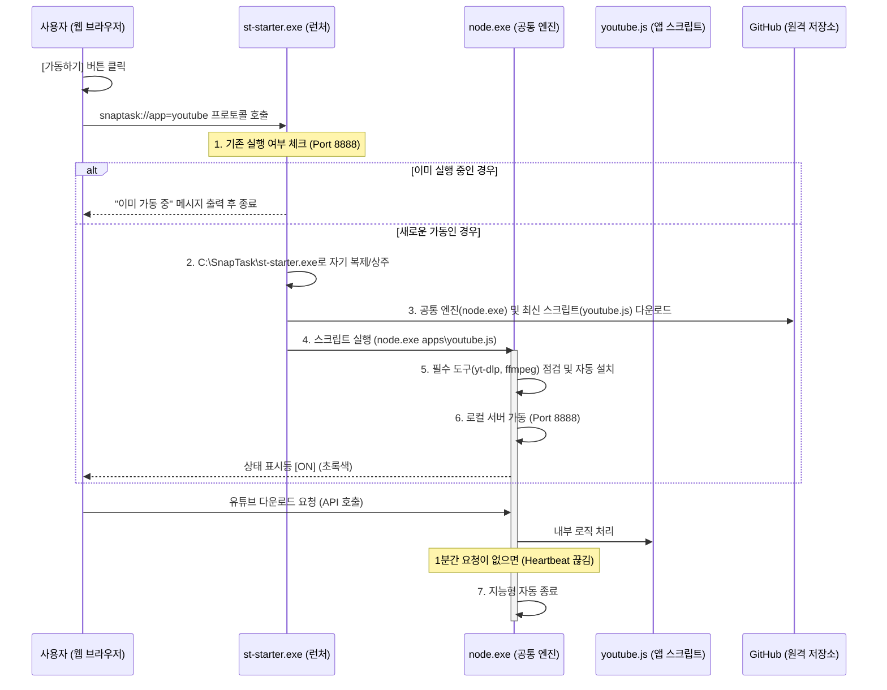

# Snap-Task V2: 하이브리드 플랫폼 아키텍처 가이드

이 문서는 Snap-Task V2의 설계 구조와 핵심 프로세스를 상세히 기록하여, 새로운 작업자(또는 AI)가 프로젝트를 즉시 파악할 수 있도록 돕습니다.

---

## 1. 시스템 개요 (System Overview)
Snap-Task V2는 **"최초 1회 설치로 모든 도구를 실행하는 범용 플랫폼"**입니다. 
무거운 실행 파일들을 개별 배포하는 대신, 공통 Node.js 엔진과 가벼운 JavaScript 스크립트를 조합하여 혁신적인 경량화를 달성했습니다.

## 2. 전체 실행 흐름도 (Sequence Diagram)

## 3. 핵심 기술 명세

### 3.1 커스텀 프로토콜 (`snaptask://`)
- **등록 경로**: `HKCU\Software\Classes\snaptask`
- **역할**: 웹 브라우저의 샌드박스를 넘어 로컬 실행 파일(`st-starter.exe`)을 직접 깨우는 브릿지 역할을 합니다.

### 3.2 통합 스타터 (`st-starter.exe`)
- **언어**: C# (.NET Framework)
- **주요 기능**:
  - **자기 복제**: 실행 시 자신을 `C:\SnapTask\st-starter.exe`로 복사하여 영구 상주 경로를 확보합니다.
  - **엔진 관리**: 공통 `node.exe`의 존재 여부를 확인하고 없으면 자동 설치합니다.
  - **중복 방지**: 8888 포트 응답 확인을 통해 중복 실행을 완벽히 차단합니다.

### 3.3 로컬 에이전트 (`*.js`)
- **런타임**: Node.js (Portable)
- **주요 기능**:
  - **설치 로직**: `yt-dlp.exe`, `ffmpeg.exe` 등의 바이너리 존재 여부를 체크하고 진행률(Gauge)과 함께 자동 설치합니다.
  - **지능형 종료**: 서버 연결이 끊긴 후 1분간 요청이 없으면 프로세스를 종료하여 리소스를 회수합니다.

## 4. 폴더 구조 및 역할

- `c:\web-toolbox\` : 전체 프로젝트 루트
  - `dist\` : 배포용 파일 저장소 (`st-starter.exe` 등)
  - `projects\` : 소스 코드 저장소
    - `st-starter\` : C# 스타터 프로젝트
    - `yt-agent\` : 유튜브 다운로더 에이전트 소스 (`youtube.js`)
  - `web\` : 프론트엔드 웹 소스
    - `pages\` : 각 도구별 HTML 페이지 (`youtube.html` 등)
    - `assets\` : 공통 CSS, JS, 이미지
- `C:\SnapTask\` : **사용자 PC 설치 경로**
  - `runtime\` : 공통 `node.exe` 위치
  - `apps\` : 다운로드된 각 도구별 스크립트 (`youtube.js` 등)
  - `bin\` : 외부 바이너리 위치 (`yt-dlp.exe`, `ffmpeg.exe`)

---
**이 문서는 Snap-Task V2의 최종 표준 아키텍처를 따릅니다.**
마지막 업데이트: 2026-03-26 (AI Antigravity)
